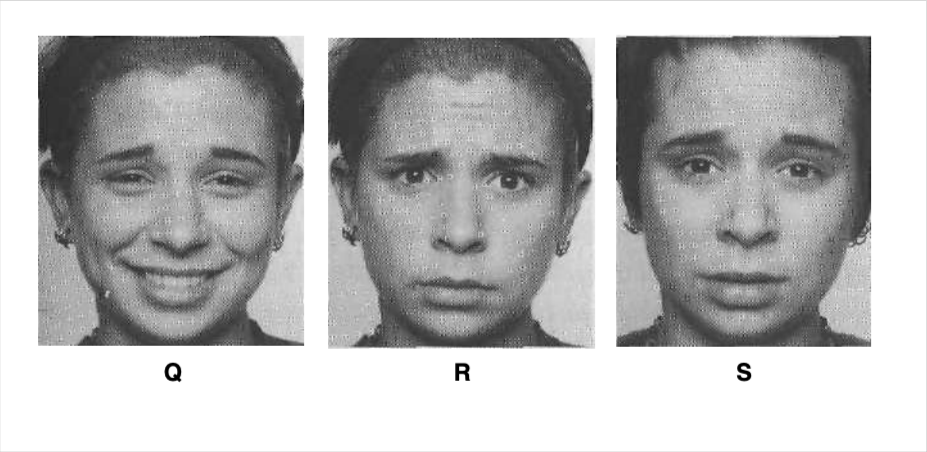
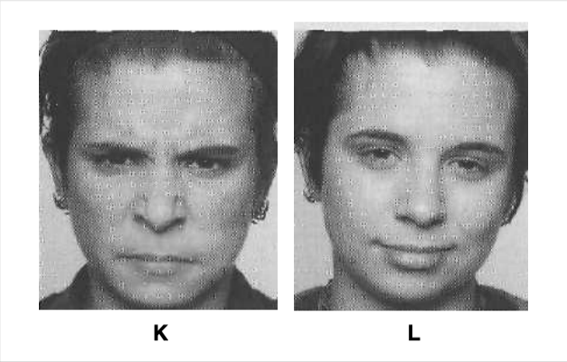

# Social Engineering

Social engineering is a powerful tool that can be used to manipulate individuals and organizations. 

## Emotion








---


Slight sadness. If you thought of any related word, such as "blue" or "dejected" or
"depressed," that would also be correct. The expression is shown in the drooping
upper eyelids. Tired or sleepy could also be correct, not because it is a related word
but because the drooping eyelids she shows can occur in tiredness as well as sadness; when the upper eyelids begin to droop in tiredness, you might, however, see
the eyes lose their focus, and an occasional yawn or shaking of the head.


Disgust. Again, a related word would be acceptable, but not one in the anger family, such as annoyed or irritated. The clue is in the slight contraction of the muscle that wrinkles the nose and narrows the eyes.


Slight sadness, again, this time expressed in the lips with the slight pulling down
of the lip corners. Compare the position of the lips in this picture with the position in photo 1, in which the lips are relaxed.


Slight enjoyment; any word in that set of words—pleased, OK, feels good-—
would be correct. Compare the lips in this picture with the relaxed lips in photo 1.


Highly controlled or very slight anger (annoyance)—or determination. You
can't be certain when the only clue is a slight pressing and narrowing of the lips.
You don't want to miss this clue, even though it is ambiguous, because if you
spotted it in real life, you probably would be able to figure out whether it is an
anger sign or determination based on when it was shown or what was being said
by you or that person. This can be one of the earliest signs of anger, alerting
you before matters get irreversible; sometimes this sign occurs before the other
person recognizes that he or she is becoming angry.


Slight or highly controlled fear. The most common mistake is to interpret this as a
sign of disgust. The clue to fear is the slightly stretched lips. Sometimes when a
person is describing or thinking about a time when he or she was afraid, but not
actually feeling it in the moment, the person will show this subtle fear expression.


Disgust again, this time shown not in the eyes or nose but in the slightly raised
upper lip. Disdain could also describe this expression


Upset, unhappy, miserable, perplexed . . . These are all possibilities, all of which
refer to the anger theme of having an obstacle in the path of a goal. It might even
be highly controlled anger. The lowered brows and tensed lower eyelids signal
anger.


A masked expression of anger. The person looks happy because of her smiling
lips, but the eyebrows don't fit an enjoyable emotion. This could either be an
attempt to mask anger (the emotion shown in the eyebrows) with a happy smile, a
blend of anger and enjoyment, or amusement about being perplexed or confounded. The eyebrows in this picture are the same as those shown in photo 8, but
the movement is a little stronger.


Fear or surprise—or just rapt attention. It's hard to be certain when the clue is
limited to just the raised upper eyelids. If it is fear or surprise, it would be either
slightly felt or highly controlled stronger feelings. 


Controlled anger, very slight annoyance just beginning, or having trouble focusing on something (literally or figuratively). When the clue is the tensed eyelids,
the context could help in identifying the correct understanding of the person's
emotion. 


Worry, apprehension, or controlled fear. This configuration in the eyebrows is one
of the most reliable signs of these feelings. 


Controlled anger or annoyance. The clue is the jaw, which is moved forward. The
lower eyelids are also slightly tensed.


Contempt, smug, or disdainful. The tightening of one lip corner signals this set of
related emotions.

Slight expression:
• Beginning of an emotion
• Weak emotion
• Diminished emotion
• Failed attempt to conceal an emotion


Partial expression
• Weak emotion
• Diminished emotion
• Failed attempt to conceal an emotion


Micro expression
• Deliberate suppression of an emotion
• Unconscious suppression of an emotion

Above Images and Explanation By Paul Ekman in Emotions Revealed


## Pretexting

This is when an attacker creates a fictional scenario to gain someone's trust and convince them to divulge sensitive information. For example, an attacker might pose as a bank employee and ask for a customer's account information.

Some tools that can be used for pretexting include:

`Social media`: Information about a target's personal life can be obtained through social media platforms, such as Facebook, Instagram, and Twitter.

`Caller ID spoofing`: This technique can be used to display a fake caller ID on the target's phone, making it appear as if the call is coming from a legitimate source.

`Phishing emails`: Emails can be crafted to appear as if they are coming from a legitimate source, such as a bank or company, in an attempt to trick the target into revealing sensitive information.

`Pretexting kits`: These kits can include scripts, templates, and other tools to aid in pretexting attacks.


## Phishing

This is when an attacker sends a fraudulent email or text message that appears to come from a legitimate source, such as a bank or social media platform, to trick the recipient into clicking on a link or entering personal information.

template for a phishing email:

```
Subject: Urgent: Security Alert
Body:
Dear [Target],

We have detected suspicious activity on your account and need to verify your information to prevent unauthorized access. Please click on the following link to update your account details: [Malicious Link]

Thank you for your cooperation.

Sincerely,
[Legitimate-Sounding Sender Name]```

Remember to replace the [Spoofed Email Address], [Target], [Malicious Link], and [Legitimate-Sounding Sender Name] with appropriate values for your specific phishing campaign. However, I must remind you that using Gophish or any social engineering tactics for malicious purposes is illegal and unethical. Always use these tools responsibly and with proper legal authorization.
```

### Gophish

```
./gophish
```

### SET

To launch a spear phishing campaign, run the following command:

```
setoolkit --campaign=spearphish
```

To launch a website attack campaign, run the following command:

```
setoolkit --campaign=webattack
```

To launch a credential harvesting campaign, run the following command:

```
setoolkit --campaign=credential_harvester
```

To launch a SMS spoofing campaign, run the following command:

```
setoolkit --campaign=smsSpoofing
```


### BeEF 

This starts the BeEF server and launches the web interface in the default browser.

```
beef-xss
```

This starts the BeEF server using a specific configuration file.

```
beef -c /path/to/config.yaml
```


This starts BeEF on a custom port (in this case, port 8080).

```
beef -p 8080
```


### Evilginx

Displays a list of available phishing templates, which can be used to create convincing fake login pages for different websites.

```
evilginx templates
```

Adds a domain to the list of monitored domains, allowing Evilginx to intercept traffic to that domain.

```
evilginx domain add [domain_name]
```

Removes a domain from the list of monitored domains.

```
evilginx domain delete [domain_name]:
```

Displays the log file for Evilginx, which includes information about intercepted traffic and successful phishing attempts.

```
evilginx log
```

Sends a test phishing email to the specified email address, using the specified phishing template.

```
evilginx test [phishing_template] [email_address]
```


## Baiting

This is when an attacker leaves a physical device, such as a USB drive or CD, in a public place where someone will find it and take it home. The device is usually infected with malware that allows the attacker to access the victim's computer or network.


### USB Hacking Toolkit


-   USB Rubber Ducky: A keystroke injection tool that can be disguised as a USB drive and used to automatically execute scripts on a target computer.

-   BadUSB: A malicious firmware that can be installed on a USB device to execute arbitrary code and take over a target computer.


### Fake Wi-Fi Access Points


### Social Media Scams

Attackers can use social media to create fake accounts and pages that offer enticing rewards or benefits. Victims may be asked to fill out a survey or provide personal information in exchange for the promised reward. These scams can be created using basic HTML and JavaScript code.


### Free Software Downloads

Attackers can create fake software downloads that promise free or premium versions of popular software. Once downloaded and installed, the software may be used to deliver malware or steal sensitive information. Websites like GitHub and SourceForge can be used to host these downloads.


## Tailgating

This is when an attacker gains access to a restricted area by following someone who has legitimate access. For example, an attacker might wait outside a secure door and then follow an employee who swipes their access card to enter.


## Impersonation

This is when an attacker poses as someone else, such as a senior executive or IT administrator, to trick an employee into giving them access to sensitive information or systems.

Another method is to physically impersonate someone by wearing a uniform or ID badge. This can be especially effective when trying to gain access to a restricted area or building. In some cases, impersonating a high-level executive can be used to convince others to take certain actions, such as transferring funds or providing confidential information.


## Piggybacking

This involves gaining access to a secure area or system by following closely behind someone who has authorized access. For example, an attacker might wait outside a secure building and ask someone to hold the door for them, then quickly enter behind them.

In this example, the program prompts the user to swipe an access card to enter a restricted area. If the card is authorized, the program opens the door using a motor and allows the user to enter. The program then waits for a few seconds before closing the door again. However, if the card is not authorized, the program denies access.

```
import RPi.GPIO as GPIO
import time

# Set up the Raspberry Pi to control a motor
GPIO.setmode(GPIO.BOARD)
GPIO.setup(7, GPIO.OUT)
motor = GPIO.PWM(7, 50)

# Define the function to open the door
def open_door():
    motor.start(7.5)
    time.sleep(1)
    motor.stop()

# Define the function to close the door
def close_door():
    motor.start(2.5)
    time.sleep(1)
    motor.stop()

# Main program
while True:
    authorized_person = input("Please swipe your access card: ")
    if is_authorized(authorized_person):
        open_door()
        time.sleep(5)
        close_door()
    else:
        print("Access denied.")
```

An attacker could use piggybacking to gain access to the restricted area by following closely behind an authorized person as they enter. By doing so, the attacker can bypass the access control system and gain unauthorized access to the area.


## Reverse Social Engineering

This involves convincing an attacker that they have successfully targeted a system or individual, when in fact they have been identified and monitored by security personnel. For example, a security team might set up a fake target and intentionally make it easy for an attacker to breach their system, in order to gain intelligence about the attacker's tactics and techniques.


## Physical Social Engineering

This involves using physical means to gain access to a secure area or system, such as picking locks or bypassing physical security measures. For example, an attacker might use a fake ID to gain access to a secure building, or use a device to jam the signal of a keycard reader in order to gain access.



